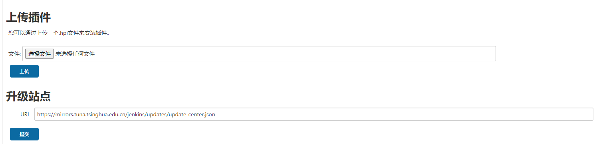
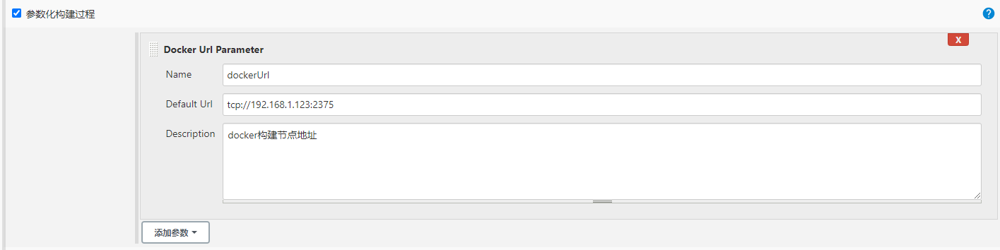
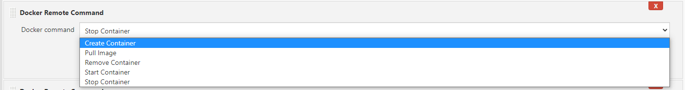
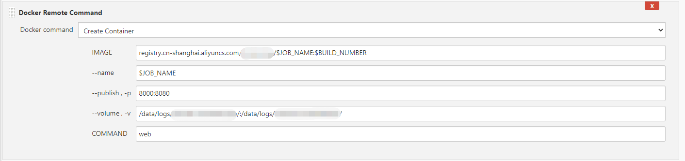
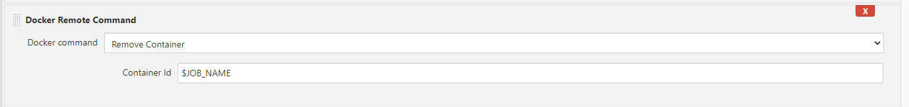
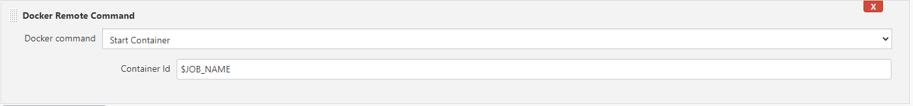
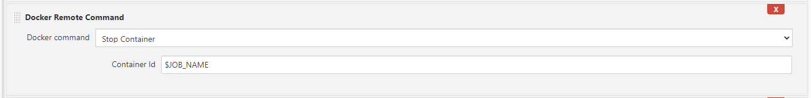

# docker-command-build-plugin

## Introduction

一个借助Docker Engine API在Jenkins构建步骤使用多个Docker Command的Jenkins插件

支持参数化Docker URL构建，每个构建项目可以使用不同的Docker Engine

## Getting started

### 打包

执行下面命令打包成hpi格式
> mvn hpi:hpi

### 安装

进到Jenkins后台插件管理上传安装插件

### 配置Docker URL

### Docker命令

- Create container

- Remove container

- Start container

- Stop container

## TODO

Others Command

## Issues

## Contributing

## LICENSE

Licensed under MIT, see [LICENSE](LICENSE.md)

